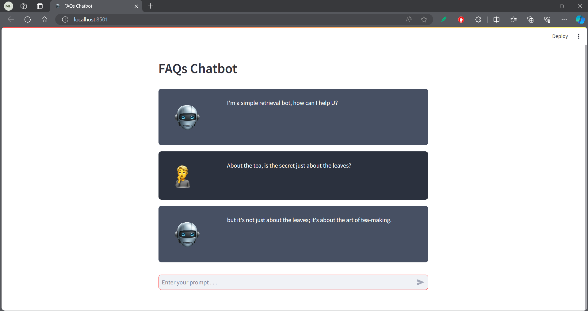

# FAQs Chatbot

This is the second task in the [CodeAlpha](https://www.codealpha.tech/) AI internship.

This repository contains code that implements a retrieval chatbot that uses data from a file `data.txt` to be able to answer user queries.


## Overview

The project is divided into the following files:

- `Rule-based chatbot from scratch.py`: module contains crafted chatbot just using **Regex** without any libraries to understand the main logic but not used in the main project.
- `Bot.py`: module implements simple retrieval chatbot with **nltk** library.
- `app.py`: simple UI using **streamlit** that enables us to deal with the boot from the browser.
- `custom_templates.py`: some templates in `html` and `css` to use them in during message rendering.
- `data.txt`: virtual data generated by AI to test our bot.


## Concepts

- [NLTK](https://www.nltk.org/)
- [Streamlit](https://streamlit.io/)
- Tokenization, stemming and lemmatization.
- TF-IDF.
- Bag of words.


## Demo




## Usage

1. Clone the repository:

    ```bash
    git clone git@github.com:mohamedhassan218/CodeAlpha_FAQs_Chatbot.git
    ```

2. Create a Virtual Environment:
    ```bash
    python -m venv .venv
    ```

3. Activate the Virtual Environment:
    - On Windows:
        ```bash
        .venv\Scripts\activate
        ```

    - On Unix or MacOS:
        ```bash
        source .venv/bin/activate
        ```

4. Install dependencies:
    ```bash
    pip install -r requirements.txt
    ```

5. Run the application:

    ```bash
    streamlit run app.py
    ```


## Contributing

Contributions are welcome! If you have any suggestions, bug fixes, or improvements, please feel free to open an issue or create a pull request.